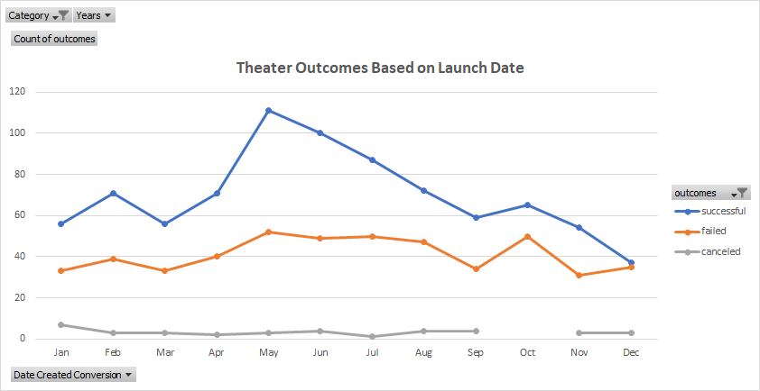
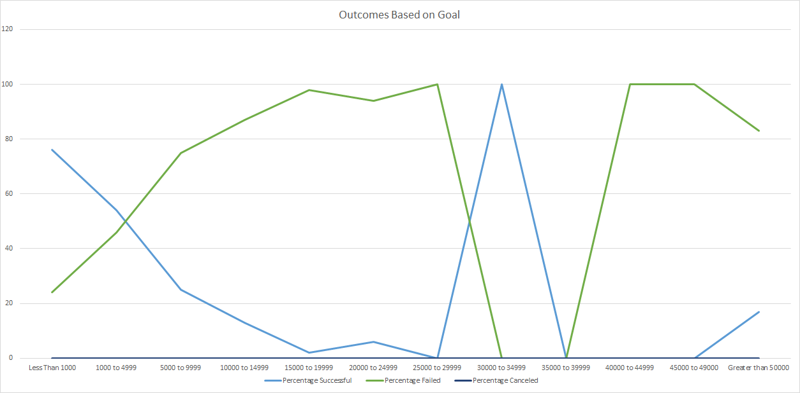

# KICKSTARTER CHALLENGE

##**Overview of Project**

###Louise is a fundraiser and has experienced a multitude of outcomes with the campaigns she has launched. Some campaingns were successful, some failed and others were cancelled. One play in particular, **_'Fever"_** came close to its fundraising goal is a fairly short amount of time. 

###Louise wants to perform some analysis to gian insight on how other campaingns faired in comparion to the **_'Fever"_** campaign. Charts and pivot tables will give a visual representation of the **Outcomes Based on Launch Date** and **Outcomes based on Goal**. 

##**Outcomes Based on Launch Date**

##**Purpose**
###The purpose of this analysis is to show the campign outcomes based on a launch date.....successful, failed and canceled. A pivot table was created with Category and Years filters and the results illustrated in a chart based on filter appied in the pivot table. 

##**Analysis**
###The first step in the campaign analysis was to use the StarterBook file used in classwork assignmen and rename to **Kickstarter Ghallenge**. Next I added a column titled Years and use the Year function to extract the year from the Date Created Column. Using the Kickstarter worksheet, I created a pivot table on a new worksheet titled **Theater Outcomes by Launch Date**. Filters were applied based on Theater category and all Years with Canceled, Failed, Successful column labels. The Date Created Conversion was place in the Rows area and grouped to only show the month.

###Using the pivot table, a line chart was created to give a visual representation of the relationship between various outcomes and the launch month. 

###I did not experience any challenges with this analysis. It was straight forward with easy to follow instructions. Some of the functions were new to me, but I was able to get assistance with a simple Google search. The only challenge I would image anyone would experience is lack of knowlegde on what formula to use. If it was specfied in the instructions, I would have ran into a roadblock. 

##**Conclusion**

###Of all years combined, July had historically experience the highest number of successful and failed theather campaigns.

###April has experienced the lowest number of successful and failed  theater campaigns. 

###Canceled campign stayed consistently low with a slight increase during the Janurary months.

##**Outcomes Based on Goals**

##**Purpose**
###The purpose of this analysis is to vizualize the percentage of successful, failed and canceled plays based on the funding goal amount for Plays. 

##**Analysis**
###This analysis began with creating a new sheet titled **Outcomes Based on Goals**. Several columns were created to show the projected goal, number of successful, failed and cancled projects, total project and the percentage of successful, failed and canceled projets. Rows were created to show multiple categories of goal amounts, ranging from Less than 1000 to Greater than 50000. The COUNTIFS function was used to populate the number and percentage of successful, failed and canceled projects.  

###Using the data on the **Outcome Based on Goals** spreadsheet, a line chart was created to show the relationship between the goal amount ranges and percentage of successful, failed and canceled projects. 

###Using the Countifs funtion was diffult to grasp and I made several mistakes. I would say this was the most diffuclt task with the analysis. In addition, using the sum function and calculating the percentages was somewhat diffucult. I was able us reflect back on some of the classwork and resources on Google to work throgh my challenges. 

##**Conclusion**

###Plays that fell in the 30000-34999, had a 100% success rate. I did not find any limitation with the data set. Additional charts that could be used to show the results are a stacked bar chart and line chart with points.

